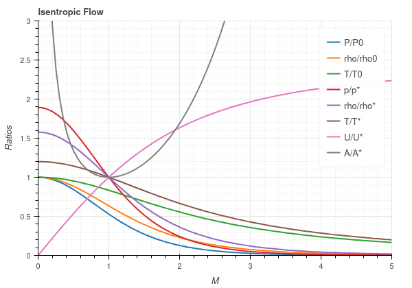

## pygasflow

**pygasflow** provides a few handful functions to quickly perform quasi-1D ideal gasdynamic (perfect gas) computations with Python (see requirements below).

The following charts has been generated with the functions included in this package:

At the moment, the following flow relations are implemented:
* Isentropic flow
* Fanno flow
* Rayleigh flow
* Shock wave relations (normal shock, oblique shock, conical shock)

The package contains the following sub-modules:
* `isentropic.py`: contains all the functions to solve isentropic flows;
* `fanno.py`: contains all the functions to solve fanno flows;
* `rayleigh.py`: contains all the functions to solve rayleigh flows;
* `showckwaves.py`: contains all the functions to solve normal/oblique/conical shock wave;
* `solvers`: the previous modules contains dozens of functions: it's hard to remember them all. For convenience, a few solvers have been implemented that, by providing a few parameters, solves the flows by computing the most important ratios (pressure ratio, ..., critical temperature ratio, ...). **This are most likely the functions you will want to use**.
* `nozzles`: it contains a few function and classes to understand convergent-divergent nozzles, Rao's TOP nozzles (Thrust Optmizie Parabolic), Minimum Length nozzle with Method of Characteristics. Nozzles can be used to quickly visualize their geometric differences or to solve the isentropic expansion through them with the `De_Laval_Solver`. 

Look at the [Usage](#Usage) section for more informations.

**This repository is still a Work In Progress and need to be properly tested. Use it at your own risk.** If you find any errors, submit an issue or a pull request!

## Requirements and Installation

* Python >= 3.6
* numpy
* scipy
* matplotlib

To install this package:
1. Download this repository.
2. Open the terminal, move into the `pygasflow` parent folder.
3. Install it with this command (all the dependencies should auto install): `python3 -m pip install .`

## Usage

The easiest way to use this code is to call the interested solver. At the moment, the following solvers are implemented:

* `isentropic_solver`
* `fanno_solver`
* `rayleigh_solver`
* `shockwave_solver`: normal shockwave and obliques shock wave.
* `conical_shockwave_solver`
* `De_Laval_Solver`: isentropic expansion through the Convergent-Divergent nozzle.

Let's say you need to solve an isentropic flow. You start by importing the `isentropic_solver`: 

`from pygasflow import isentropic_solver`

I strongly suggest to take a look at the notebooks contained in the [examples](examples/) folder. Also, take a look at the [pygasflow/tests](pygasflow/tests/) folder for more usage examples.

Should the solvers not be sufficient for your use case, feel free to explore the code implemented inside each flow's type, maybe you'll find a function that suits your needs. The code is well documented: I went for a natural language nomenclature since (I bet) most of us are using and advanced editor with autocompletion. For instance, the critical temperature T/T* is defined as `critical_temperature_ratio` across the different flows, and so on. To import a specific function defined inside a specific flow type, you can do (for instance):

`from pygasflow.isentropic import critical_temperature_ratio`

**_TODO_**:

1. Need to find a better/smarter way to chose the range where to apply bisection method..
2. The iterative procedures to solve Conical Shock Waves are incredibly slow. Is it possible to come up with a different approach?
3. Take a look at the different _TODO_ sections in the code. 