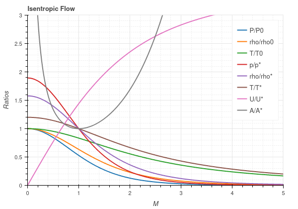
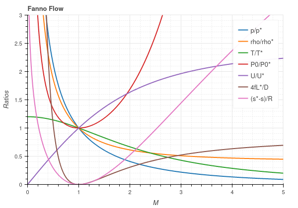
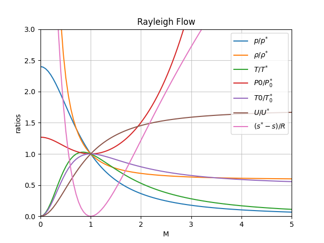
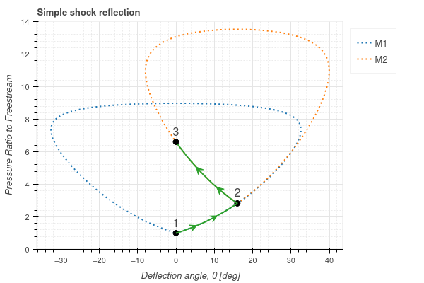

.. pygasflow documentation master file, created by
   sphinx-quickstart on Mon Jan 31 13:59:41 2022.
   You can adapt this file completely to your liking, but it should at least
   contain the root `toctree` directive.

Welcome to pygasflow's documentation!
=====================================

pygasflow provides a few handful functions to quickly perform quasi-1D ideal
gasdynamic (perfect gas) computations with Python.

The following flow relations are implemented:

* Isentropic flow
* Fanno flow
* Rayleigh flow
* Shock wave relations (normal shock, oblique shock, conical shock)

The following charts has been generated with the functions included in this package:

.. image:: _static/conical-flow.png
   :width: 200
   :alt: Conical Flow

.. image:: _static/mach-beta-theta.png
   :width: 200
   :alt: Shockwave relations

.. toctree::
   :maxdepth: 2
   :caption: Contents:

   install.rst
   modules/index.rst
   changelog.rst

Indices and tables
==================

* :ref:`genindex`
* :ref:`modindex`
* :ref:`search`
